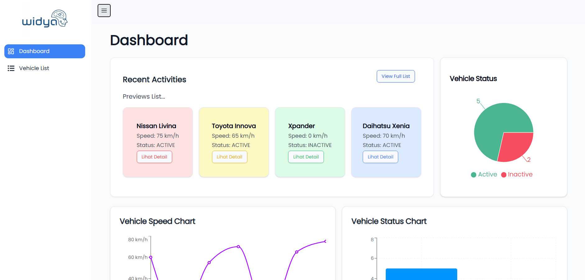

# 🚗 Vehicle Tracker Dashboard - Azzikra Ramadhanti Aksan

A responsive and interactive **Vehicle Tracker Dashboard** built with **React**, **TypeScript**, and **Vite**, designed to display vehicle telemetry data, status distribution, and recent activity. This dashboard provides a clean and modern interface for monitoring vehicle movement and status in real-time.

---

## 📸 UI Preview



---

## 🧰 Tech Stack

- **React + TypeScript** – UI development
- **Vite** – Frontend build tool
- **Tailwind CSS** – Styling
- **ShadCN UI** – Headless component library
- **Zustand** – State management

---

## ✨ Features

✅ Responsive layout optimized for all screen sizes  
✅ Pie chart of vehicle status (Active vs Inactive)  
✅ Line chart showing historical speed telemetry  
✅ Bar chart of vehicle status 
✅ Dynamic data rendering from API  
✅ Reusable and modular component structure  

---

## 🛠️ Setup Instructions

### 1. Clone the Repository

```bash
git clone https://github.com/azzikraaksan/vehicle-track.git
```

### 2. Install Dependencies
```bash
npm install
```


### 3. Start the Development Server
```bash
npm run dev
```
